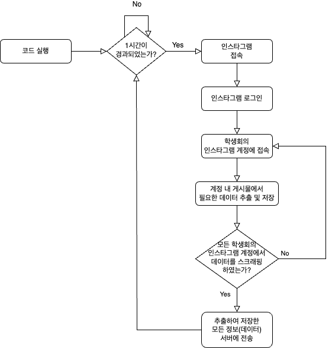

# [모아봤SSU] 웹 스크래핑 기반 숭실대 통합 공지 사이트

> 개요

'모아봤SSU'는 숭실대학교 학생들에게 서비스를 제공하는 웹사이트로 숭실대학교의 각종 교내 홈페이지 및 학교 공식 SNS 계정 등에 공지된 게시글을 스크래핑하여 학교와 관련된 모든 공지사항을 한 곳에서 모아볼 수 있도록 한다.

 

> 배경 및 필요성

- 배경

    대학 생활에 필요한 각종 공지들은 교내 홈페이지, SNS 등 여러 곳에서 통일성 없이 업로드 되고 있다. 현재 학교 및 학과 홈페이지 등과 같은 교내 홈페이지에 업로드 된 공지사항들을 한 곳에서 확인할 수 있는 서비스는 존재한다. 그러나 실질적으로 유용한 정보를 안내해주는 학생회들은 SNS 계정을 통해 공지사항을 전달하기 때문에 기존의 서비스들은 학교와 관련된 모든 공지사항을 한 곳에 모으지 못했다는 한계를 가지고 있다.

- 필요성
    - 각 사이트마다 돌아다니며 공지사항을 찾아야하는 번거로움 존재
    - 학생회 공지를 받기 위해 SNS에 회원가입을 해야하는 불편함 존재
    - 공지사항 중 자신에게 필요한 정보를 찾기 위해 많은 시간 소요

 

> 기대효과

- 숭실대학교 학생들이 필요한 학교 정보를 찾는 데에 있어 번거로움 해소 가능
- 많은 공지사항 중 필요한 공지사항을 찾아내는 데에 소요되는 시간 단축 가능
- 숭실대학교 내에서 뿐만 아니라 취업 정보, 공모전 정보 등 여러 분야에 걸쳐 활용 가능할 것으로 기대

 
 

## 프로젝트 과정: 스크래핑(Scraping) 파트

학교, 학과 등의 여러 홈페이지에 흩어져있는 공지사항들을 모두 취합하여 ‘모아봤SSU’ 홈페이지에 나타내기 위해서는 스크래핑(Scraping)이 필수적이다. 따라서 스크래핑을 통해 모든 공지사항들의 **url을 추출**하고, 추출한 url을 통해 각각의 공지사항 페이지에 접속하여 ‘모아봤SSU’ 홈페이지를 구성하는 데에 필요한 데이터들을 추출 및 저장하였다. 또한 각 홈페이지 내 공지사항이 언제 새로 업로드 될지 모른다는 특징 때문에, **schedule 모듈**을 활용하여 **1시간에 한 번씩** 코드를 자동 실행시켜 데이터들이 1시간마다 새롭게 업데이트 될 수 있도록 하였다.

스크래핑의 대상이 되는 홈페이지는 **학교 홈페이지**, **IT대학 소속 학과 홈페이지**(컴퓨터학부, 전자정보공학부, 소프트웨어학부, 글로벌미디어학부, AI융합학부), **fun 시스템**, **학생회 인스타그램**(총학생회, IT대학, 컴퓨터학부, 전자정보공학부, 소프트웨어학부, 글로벌미디어학부, AI융합학부)이며, 스크래핑의 방식은 크게 **인스타그램이 아닌 홈페이지에서의 스크래핑**과 **인스타그램 게시물 스크래핑** 두 가지로 나뉜다. 방식이 나뉘게 된 까닭은 다음과 같다. 첫째, 인스타그램은 데이터를 자바스크립트를 통해 동적으로 생성한다. 반면에 그 외의 학교 관련 홈페이지들은 대부분 정적인 페이지로 구성되어 있다. 둘째, 인스타그램은 정책으로 인해 스크래핑 시 인스타그램 로그인이 필수적이다. 스크래핑 시 자동으로 로그인을 하기 위해서는 사이트의 다양한 HTML 요소에 클릭, 키보드 입력 등 이벤트를 주는 것이 필수이기 때문에 스크래핑 방식에 차이가 발생하였다.

 

> 인스타그램이 아닌 홈페이지 (학교 홈페이지, 학과 홈페이지, 펀시스템)

인스타그램이 아닌 홈페이지, 즉 학교 홈페이지, IT대학에 소속되어 있는 각각의 학과 홈페이지, fun 시스템 사이트에 대한 스크래핑은 requests 모듈을 통해 텍스트 형태의 html을 가져온 후, 가져온 html에서 html 태그를 손쉽게 추출할 수 있도록 BeautifulSoup 모듈을 활용하여 진행했다. 즉, 홈페이지(페이지)에 접속하여 html를 가져오고, 가져온 html에서 태그 등을 활용하여 필요한 정보를 추출하는 방식으로 스크래핑을 진행했다.

 

> 인스타그램 게시물

기존에는 학생회의 인스타그램 게시물에 대한 스크래핑도 위와 같은 방식으로 진행하고자 했다. 그러나 인스타그램 정책 등의 이유로 로그인 없이는 스크래핑이 불가능했다. 따라서 인스타그램 게시물, 즉 여러 학생회가 업로드한 게시물에 대한 스크래핑은 web driver와 selenium을 통해 인스타그램에 자동 로그인한 후, 데이터를 추출하고자 하는 학생회의 인스타그램 계정에 접속하여 selenium을 통해 html을 가져온 후, 가져온 html에서 html 태그를 손쉽게 추출할 수 있도록 BeautifulSoup 모듈을 활용하여 진행했다. 즉, 인스타그램에 로그인하여 html을 가져오고, 가져온 html에서 태그 등을 활용하여 필요한 정보를 추출하는 방식으로 스크래핑을 진행했다. 

 